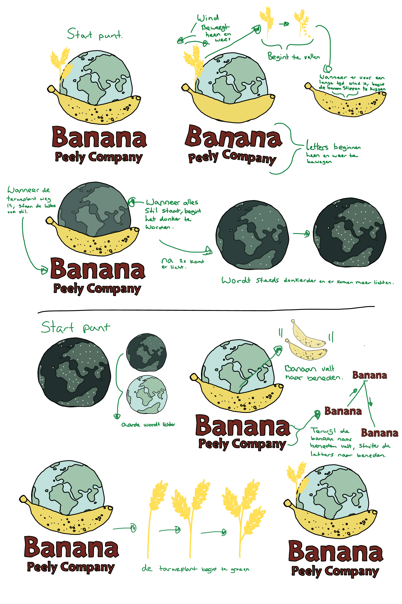
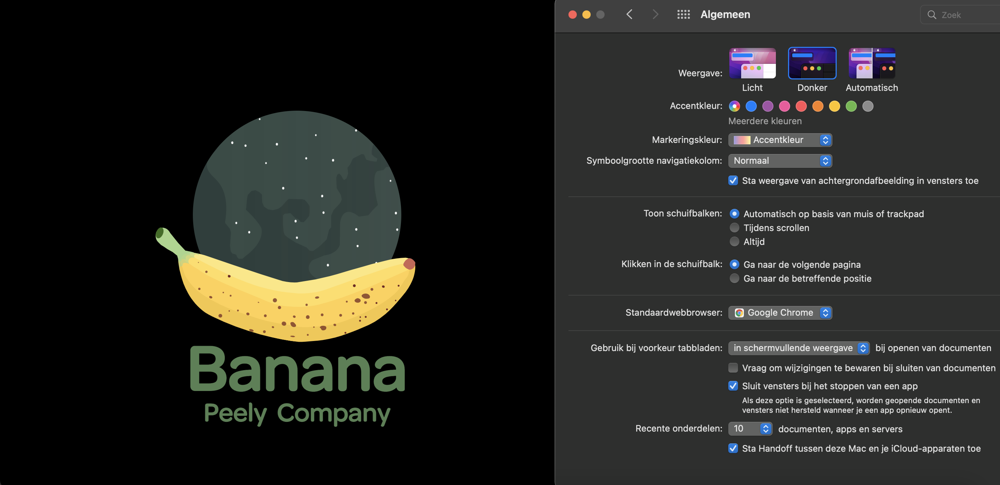
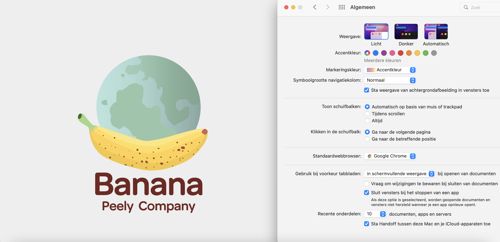
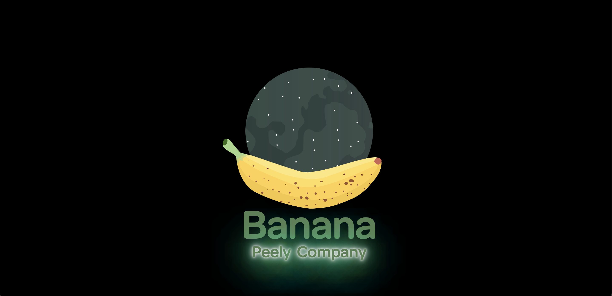
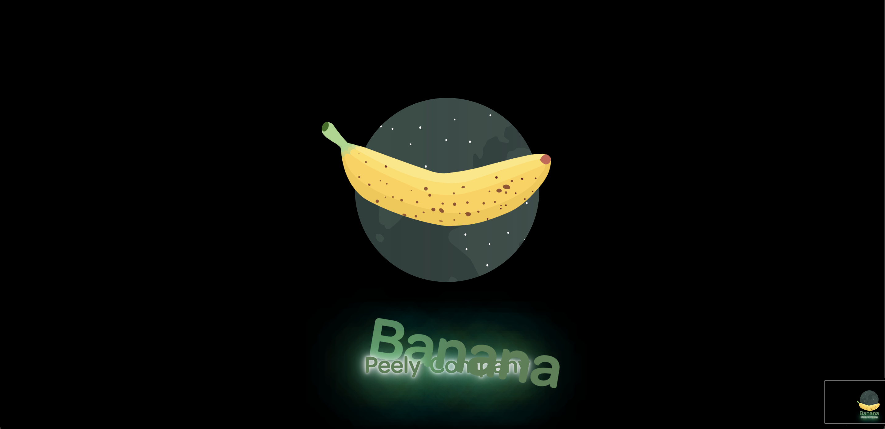
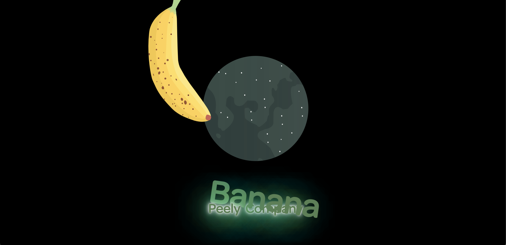
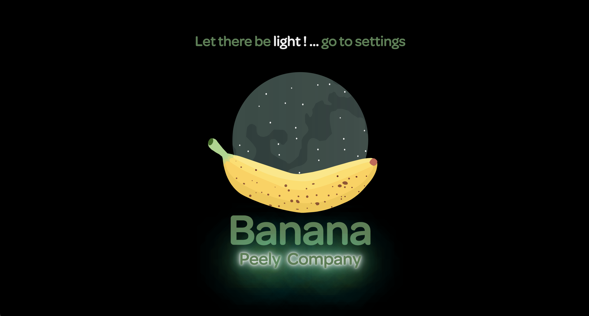
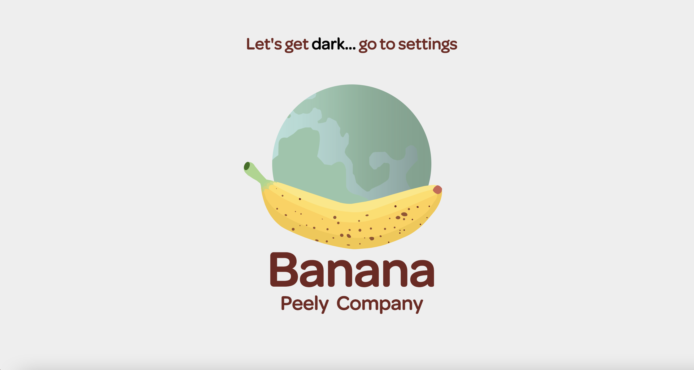
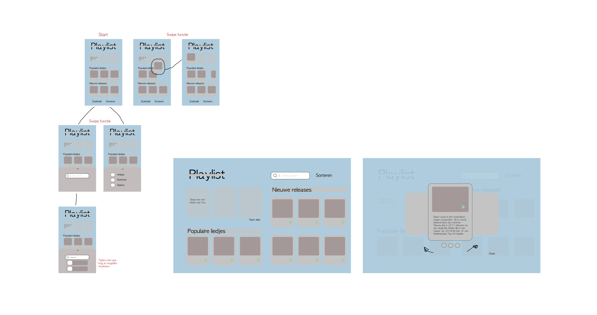
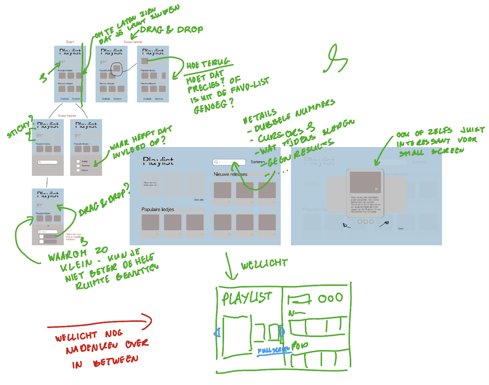

# Procesverslag
**Auteur: 
Gloria Kwako 👾

**De opdrachten:** [opdracht 1](opdracht1/index.html) en [opdracht 2](opdracht2/index.html)

Voor deze opdracht heb ik gekozen om voor het nieuwe bedrijf Banana Peely Company het logo te animeren, dit bedrijf is opgestart door een paar laatste jaars studenten (onder wie mijn eigen zus) van de opleiding Food Commerce and Technology in Amsterdam.

Zij hebben mij gevraagd om een nieuwe logo te ontwerpen waardoor het mij ook meteen een leuk idee vond om voor het vak FvD een animatie van hun logo te maken. 

## Opdracht 1 plan

  
uitwerken na schetsen idee (voor week 2)

  ### Je storyboard:
  

  ### Je ambitie: 
  Aan deze technieken/punten wil ik werken:
  - Dark en licht mode, dit wordt een uitdaging omdat ik niet veel kennis heb over CSS maar wel de motivatie om het uit te proberen.
  - Elementen geleidelijk laten vallen, daar moet ik onderzoek voor doen.
 

## Opdracht 1 reflectie

  
uitwerken bij afronden opdracht (voor week 3)

  ### Je uitkomst - karakteristiek screenshot(s):
  
    

  ### Dit ging goed/Heb ik geleerd: 
  Bij de darkmode is het mij gelukt om een leuke schaduw toe te voegen bij de letters en natuurlijk de dark mode zelf.

  Hier zie je als je computer dark mode aan heeft staan dat de layout helemaal veranderd is naar dark: 
  

  En bij de light mode is alles juist lichter: 
  

  Dit zijn de animaties die ik heb toegevoegd:
    
    
    
    
    
    

  ### Dit was lastig/Is niet gelukt:
  Het is mij helaas niet gelukt om de planten toe te voegen die bij de logo hoort, ook heb ik niet veel tijd kunnen besteden aan de light mode omdat ik erg gefocussed was op de darkmode "wat super toff was!"

  

## Opdracht 2 plan

  
uitwerken na schetsen idee (voor week 4)

  ### Je ontwerp:
  

   ### Tips:
   Aan de hand van deze tips, ga ik mijn ontwerp aanpassen en goed over nadenken welke elementen ik mee ga nemen.
  

  ### Je ambitie: 
  Aan deze technieken/punten wil ik werken:
  - Alles responsief maken
  - Met verschillende bedieningen werken
  - Animaties
  - ...

## Opdracht 2 test

  
uitwerken na testen (week 6/7)

  Neem minimaal 5 bevindingen op:
  

  ### Bevinding 1:
  Omschrijving van wat er nog niet orde was (tekst en afbeeding(en)).

  #### oplossing:
  Beschrijving hoe je het hebt hebt opgelost of als het niet gelukt is hoe je het zou oplossen (tekst en afbeeding(en)).

  ### Bevinding 2:
  Omschrijving van wat er nog niet orde was (tekst en afbeeding(en)).

  #### oplossing:
  Beschrijving hoe je het hebt hebt opgelost of als het niet gelukt is hoe je het zou oplossen (tekst en afbeeding(en)).

  ### Bevinding 3:
  ...

## Opdracht 2 reflectie

  
uitwerken bij afronden opdracht (voor week 8)

  ### Je uitkomst - karakteristiek screenshot(s):
  

  ### Dit ging goed/Heb ik geleerd: 
  Korte omschrijving met plaatje(s)

  

  ### Dit was lastig/Is niet gelukt:
  Korte omschrijving met plaatje(s)

  

## Bronnenlijst
  1. - Animatie drop: https://www.youtube.com/watch?v=YszONjKpgg4 (regel: 148)
  2. - Earth spin: https://www.youtube.com/watch?v=9HXpirUu_H4 (regel: 173)
  3. - Dark mode: https://css-tricks.com/a-complete-guide-to-dark-mode-on-the-web/#os-level (regel: 355)
  4. - Neon: https://css-tricks.com/how-to-create-neon-text-with-css/ (regel: 260)
  5. - Fall: https://www.youtube.com/watch?v=YszONjKpgg4 (regel: 221)
  6. text appears: https://www.youtube.com/watch?v=PP0Os0UvMCs&t=89s (regel: 150)